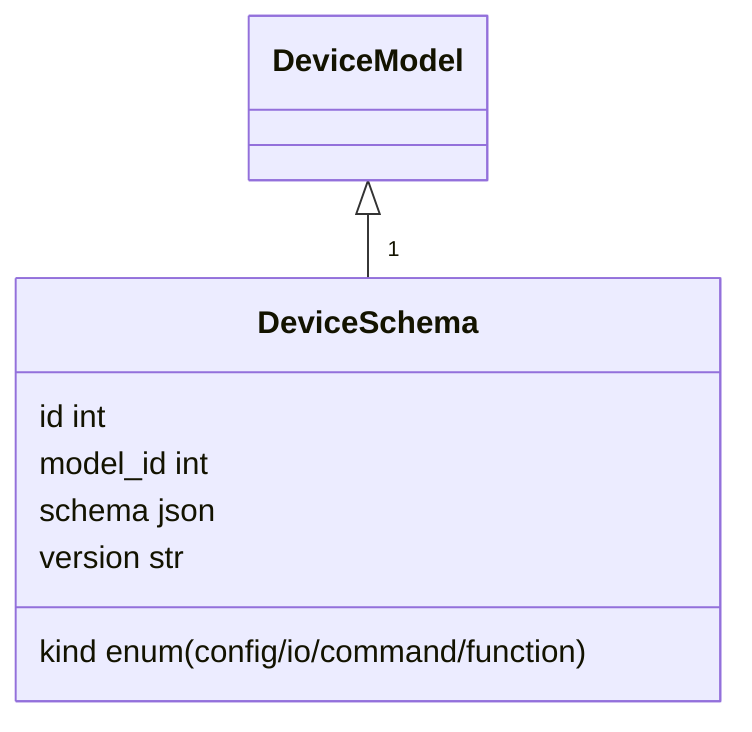

# Factory Lens – Action & Automation Data Model

## 1.  Why a new model?

Factory Lens treats everything as a **device**.  To let *any* device take part in
logic flows (from a relay to a cloud API) we store **what the device can do and
what it produces** in structured JSON that the UI and runtime both understand.

The result is a single chain structure that powers quick 3‑step **Actions** and
full drag‑and‑drop **Automations**.

---

## 2.  Device‑level self‑description

Each concrete `DeviceModel` may link to *multiple* JSON schemas, each flagged by
`kind`:

| `kind`     | Purpose                                                      |
| ---------- | ------------------------------------------------------------ |
| `config`   | Long‑lived device settings (was our original `json_schema`). |
| `io`       | **Outputs** the device *emits* – a topic, file, stream, …    |
| `command`  | **Inputs** the device *accepts* that mutate state.           |
| `function` | Callable routines that combine I/O and return a payload.     |

All records share the same SQL model `device_schemas` – the `kind` column
distinguishes the flavour.



### 2.1  `io` + `command` scaffold

```jsonc
{
  "relay/0": {
    "label": "Relay 0 state",
    "type": "enum",
    "values": ["on", "off"],
    "category": "io"               // produces data
  },
  "relay/0/command": {
    "label": "Relay 0 command",
    "type": "enum",
    "values": ["on", "off"],
    "category": "command"          // consumes data
  }
}
```

### 2.2  `function` example (Hilook camera)

```jsonc
{
  "snapshot": {
    "label": "Take snapshot",
    "accepts": ["ignore"],          // no input needed
    "produces": "image/jpeg",
    "args": {}
  }
}
```

---

## 3.  Rule chain (`action_rules` table)

Each rule is stored as one row with a JSON `chain` array:

```jsonc
[
  {  // 0 — IF
    "device_id":  12,
    "source":     "io",
    "topic":      "input_event/0",
    "match":      {"event":"L"}
  },
  {  // 1 — THEN
    "device_id":  33,
    "function":   "snapshot",
    "ignore_input": true
  },
  {  // 2 — EVAL success branch
    "device_id":  44,
    "function":   "save_file",
    "branch":     "success",
    "args":       {"folder":"snapshots/"}
  },
  {  // 3 — EVAL error branch
    "device_id":  55,
    "command":    "publish",
    "branch":     "error",
    "args":       {"topic":"alerts","payload":"Snapshot failed"}
  }
]
```

*Fields*
`device_id` • `source|function|command|topic` • `args` • `branch` • `ignore_input`

---

## 4.  Runtime guarantees

* **Type matching** – A node is selectable only if its first input type appears
  in `accepts[]` of the function/command *unless* `ignore_input=true`.
* **Loop guard** – executor hashes `(rule_id, payload_hash)` for 2 s to drop
  identical back‑to‑back triggers.
* **Payload stack** – every node pushes its output; templating `${payload[-1].id}`
  available to downstream args.

---

## 5.  Example walk‑through

> *When Shelly button long‑pressed* → *take snapshot* → *save to local storage* →
> *on error publish MQTT alert*

| Step | Device  | Function / IO     | Output type        | Notes                                |
| ---- | ------- | ----------------- | ------------------ | ------------------------------------ |
| 0    | Shelly  | `input_event/0=L` | `application/json` | Trigger                              |
| 1    | Hilook  | `snapshot()`      | `image/jpeg`       | *ignore\_input=true* bypass mismatch |
| 2    | Storage | `save_file()`     | `application/json` | Runs on *success*                    |
| 3    | Logger  | `publish()`       | `void`             | Runs on *error*                      |

---

## 6.  Future‑proofing

* **Timers** – add `delay_ms` field to any node.
* **Conditional branches** – beyond success/error, allow `branch:"custom"` with
  an expression evaluated on payload.
* **Live debug** – `action_rule_runs` (rule\_id, node\_idx, payload, ts, ok, …).

---

## 7.  Glossary

| Term              | Meaning                                                                             |
| ----------------- | ----------------------------------------------------------------------------------- |
| **IO**            | Anything the device *emits* spontaneously (sensor reading, relay state).            |
| **Command**       | A topic or API the device *listens* to that changes state.                          |
| **Function**      | A higher‑level callable that may combine I/O and commands and returns a payload.    |
| **Ignore input**  | Flag that disables type checking for that node so any upstream payload is accepted. |
| **Payload stack** | Ordered list of all outputs produced so far in a chain run.                         |

---

*Approved design → ready for implementation* 🎉
